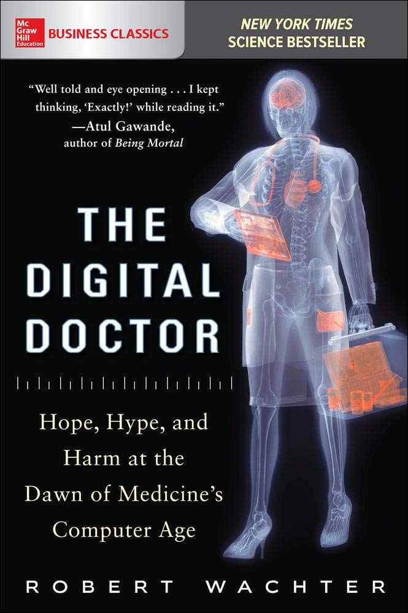
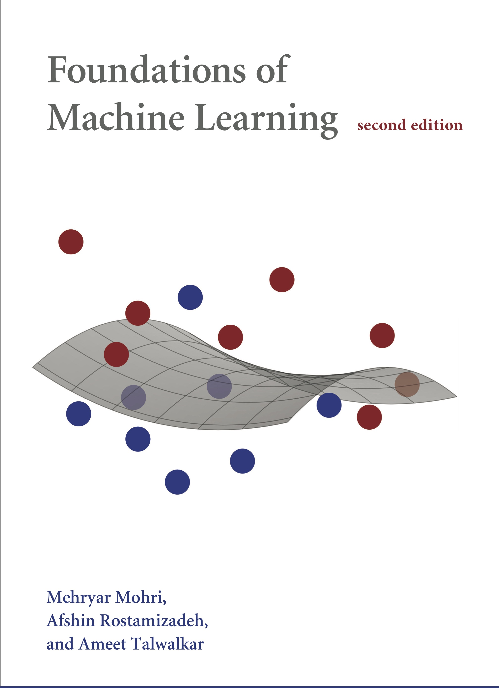

# Machine Learning for Medicine and Healthcare

## Overview

> For more information about the event, please visit [12th WBME - Workshop on Biomedical Engineering](http://wbme.fc.ul.pt/)

The ubiquity of algorithms and data is one of the hallmarks of the Information Age
. In a world powered by technology, where smartphones have more computing power than [all of NASA’s computers during the Apollo missions](https://www.youtube.com/watch?v=BRZz0SVLdso), algorithms run virtually everything.

However, in the advent of the [4th Industrial Revolution](https://www.salesforce.com/blog/2018/12/what-is-the-fourth-industrial-revolution-4IR.html), data is growing faster than it can be analyzed and classic algorithms have been unable to cope with this [Big Data explosion](https://www.internetlivestats.com/). This is where Artificial Intelligence (AI), and Machine Learning (ML) in particular, really shine. 

ML systems learn directly from data without being *explicitly* told to do so, and they have found enormous success in such tasks as email filtering, computer-aided diagnostics (CADx) and autonomous driving. Companies like Facebook, Amazon, Netflix and Google are investing heavily on AI, and ML engineer and data scientist positions are among the highest paid and “sexiest” jobs of the early 21st century. Nonetheless, getting past the hype and putting buzzwords aside is hard when one lacks a basic understanding of how these systems actually work. This is especially relevant in the health sector where transparency and accountability are of paramount importance.

In this workshop, we will give an overview of what ML actually is, highlighting some of its applications to the health sector - from the rise of expert systems in the 80s to the diagnosis, prognosis and treatment of [COVID-19](https://www.worldometers.info/coronavirus/) - how it is shaping the present and how it may one day decide our future.

  

    
    
    
    
  

  

    
    
    
    
  

  

    
    
    
    
  

## Agenda

1. Overview of Artificial Intelligence and Machine Learning **(40 mins)**
    * Historical Perspective
    * What is AI?
    * What is ML?
    * Traditional Programming vs. ML
    * Learning Tasks
    * Learning Scenarios
    * ML Applications
    * ML Pipeline
    * The “Five Tribes” of ML
    * ML Algorithms
    * Debugging Problems
    *	Main challenges

2.	Machine Learning in Medicine and Healthcare **(30 mins)**
    * Patient data
        - Consumer health wearables
        - Electronic health records (EHR)
        - Clinical datasets
    * Case Studies
        - **(Wu *et al.*, 2010)** Endocrinology: Diabetes Detection
        - **(Norvig, 1992)** Hematology: MYCIN
        - **(Szolovitz, 1982)** Internal Medicine: Caduceus
        - **(Esteva *et al.*, 2017)** Dermatology: Skin Lesion Classification
        - **(Majkowska *et al.*, 2019)** Pneumology/Radiology: Chest X-Ray Interpretation
        - **(Arcadu *et al.*, 2019; Raman *et al.*, 2019)** Ophthalmology: Diabetic Retinopathy Detection and Progression
        - **(Steiner *et al.*, 2018; Wu *et al.*, 2019)** Oncology: Breast Cancer Screening
        - **(Harutyunyan *et al.*, 2019)** General Practice: Clinical Event Prediction
        - **(Libbrecht & Noble, 2019; Zou *et al.*, 2019)** AI/ML in Genetics and Genomics
        - **(Zhou *et al.*, 2020)** Surgery: Pre-Operative Planning, Intra-Operative Guidance and Surgical Robots
        - **(Gottesman *et al.*, 2019; Komorowski *et al.*, 2018)** AI/ML in the ICU: Sepsis Treatment
        - **(AWS)** NLP in Healthcare: [Amazon Comprehend Medical](https://aws.amazon.com/comprehend/medical/)
        - **(Harmon *et al.*, 2020)** COVID-19 Diagnosis
        - **(Yan *et al.*, 2020)** COVID-19 Prognosis
        - **(Arshadi *et al.*, 2020)** COVID-19 Treatment

3.	Opportunities, Challenges and Future Prospects **(20 mins)**
    * AI/ML in Healthcare: Benefits and Drawbacks
    * Opportunities
        - ML and Ethics
        - ML and Cloud Computing
        - Federated Learning
        - Meta-Learning: *learning to learn*
    * Future Directions
        - Green Models
        - Pattern Recognition + Symbolic AI
        - MLOps
        - Quantum Machine Learning

## References

### Books

#### Basic

  

    
    
    
    
    
    
    
  

  

    
    
    
    
    
    
    
  

#### Advanced

  

    
    
    
    
    
    
    
  

  

    
    
    
    
    
    
    
  

### Articles

**Altae-Tran, H. *et al*. (2017)**. Low data drug discovery with one-shot learning. *ACS Cent. Sci.*, 3: 283-293

**Arcadu, F. *et al*. (2019)**. Deep learning algorithm predicts diabetic retinopathy progression in individual patients. *Npj Digit. Med.*, 2: 92-101

**Arshadi, A. *et al*. (2020)**. Artificial intelligence for COVID-19 drug discovery and vaccine development. *Front. Artif. Intell.*, 3: 65

**Biamonte, J. *et al*. (2018)**. Quantum Machine Learning. *Nature*, 549: 195-202

**Chen, I. *et al*. (2020)**. Ethical machine learning in healthcare. *Retrieved from* [arXiv:2009.10576](https://arxiv.org/abs/2009.10576)

**Ching, T. *et al*. (2018)**. Opportunities and obstacles for deep learning in biology and medicine. *J. R. Soc. Interface*, 15: 20170387

**Domingos, P. (2012)**. A few useful things to know about machine learning. *Comm. ACM*, 55(10): 78-87

**Esteva, A. *et al*. (2017)**. Dermatologist-level classification of skin cancer with deep neural networks. *Nature*, 542: 115-118.

**Esteva, A. *et al*. (2019)**. A guide to deep learning in healthcare. *Nat. Med.*, 25: 24-29

**Garnelo, M., Arulkumaran, K. & Shanahan, M. (2016)**. Towards Deep Symbolic Reinforcement Learning. *Retrieved from* [arXiv:1609.05518](https://arxiv.org/abs/1609.05518)

**Ghassemi, M. *et al*. (2018)**. A review of challenges and opportunities in machine learning for health. *Retrieved from* [arXiv:1806.00388](https://arxiv.org/abs/1806.00388)

**Gottesman, O. *et al*. (2019)**. Guidelines for reinforcement learning in healthcare. *Nat. Med.*, 25: 14-18

**Harmon, S. *et al*. (2020)**. Artificial intelligence for the detection of COVID-19 pneumonia on chest CT using multinational datasets. *Nat. Commun.*, 11: 4080

**Harutyunyan, H. *et al*. (2019)**. Multitask learning and benchmarking with clinical time series data. *Sci. Data*, 6: 96 

**Hassabis, D. *et al*. (2017)**. Neuroscience-inspired artificial intelligence. *Neuron*, 95(2): 245-258

**Jiang, F. *et al*. (2017)**. Artificial intelligence in healthcare: past, present and future. *Stroke Vasc. Neurol.*, 2: e000101

**Kalis, B., Collier, M. & Fu, R. (2018)**. 10 promising AI applications in health care. *Retrieved from* [Harvard Business Review](https://hbr.org/2018/05/10-promising-ai-applications-in-health-care)

**Komorowski, M. *et al*. (2018)**. The artificial intelligence clinician learns optimal treatment strategies for sepsis in intensive care. *Nat. Med.*, 24: 1716-1720

**Libbrecht, M. & Noble, S. (2015)**. Machine learning applications in genetics and genomics. *Nat. Rev. Genet.*, 16: 321-332

**Lillicrap, T. *et al*. (2020)**. Backpropagation and the brain. *Nat. Rev. Neurosci.*, 21(6): 335-346

**Litjens, G. *et al*. (2017)**. A survey on deep learning in medical image analysis. *Retrieved from* [arXiv:1702.05747](https://arxiv.org/abs/1702.05747)

**Lotte, F. *et al*. (2018)**. A review of classification algorithms for EEG-based brain-computer interfaces: a 10 year update. *J. Neural Eng.*, 15: 031005

**Majkowska, A. *et al*. (2020)**. Chest radiograph interpretation with deep learning models: assessment with radiologist-adjudicated reference standards and population-adjusted evaluation. *Radiology*, 294(2): 421-431

**Mnih, V. *et al*. (2015)**. Human-level control through deep reinforcement learning. *Nature*, 518: 529-533

**Nam, C. *et al*. (2018)**. Brain-Computer Interfaces Handbook: The Technological and Theoretical Advances. Boca Raton, FL: CRC Press

**Panch, T., Szolovits, P. & Atun, R. (2019)**. Artificial intelligence, machine learning and health systems. *J. Glob. Health*, 8: 020303

**Piwek, L. *et al*. (2016)**. The rise of consumer health wearables: promises and barriers. *PLOS Medicine*, 13(2): e1001953

**Rajkomar, A., Dean, J. & Kohane, I. (2019)**. Machine learning in medicine. *N. Engl. J. Med.*, 380: 1347-1358

**Raman, R. *et al*. (2019)**. Fundus photograph-based deep learning algorithms in detecting diabetic retinopathy. *Eye*, 33: 97-109

**Ravì, D. *et al*. (2017)**. Deep learning for health informatics. *IEEE Journ. Biom. Health Inform.*, 21(1): 4-21

**Ribeiro, M., Singh, S. & Guestrin, C. (2016)**. “Why should I trust you?” Explaining the predictions of any classifier. *Retrieved from* [arXiv:1602.04938](https://arxiv.org/abs/1602.04938)

**Rieke, N. *et al.* (2020)**. The future of digital health with federated learning. *Retrieved from* [arXiv:2003:08119](https://arxiv.org/abs/2003.08119)

**Samuel, A. (1959)**. Some studies in machine learning using the game of checkers. *IBM Journal*, 3(3): 535-554

**Sculley, D. *et al*. (2015)**. Hidden technical debt in machine learning systems. [*Adv. Neur. Inform. Proc. Syst.*](http://papers.nips.cc/book/advances-in-neural-information-processing-systems-28-2015), 28: 2503-2511.

**Schmidt, R., Schneider, F. & Hennig, P. (2020)**. Descending through a crowded valley: benchmarking deep learning optimizers. *Retrieved from* [arXiv:2005.01547](https://arxiv.org/abs/2007.01547)

**Sheller, M. *et al.* (2020)**. Federated learning in medicine: facilitating multi-institutional collaborations without sharing patient data. *Scientific Reports*, 10(1): 1-12

**Simeone, O. (2017)**. A brief introduction to machine learning for engineers. *Retrieved from* [arXiv:1709.02840](https://arxiv.org/pdf/1709.02840.pdf)

**Steiner, D. *et al*. (2018)**. Impact of deep learning assistance on the histopathologic review of lymph nodes for metastatic breast cancer. *Am. J. Surg. Pathol.*, 42(12): 1636-1646

**Strickland, E. (2019)**. IBM Watson, heal thyself: how IBM Watson overpromised and underdelivered on AI healthcare. *Retrieved from* [IEEE spectrum](https://spectrum.ieee.org/biomedical/diagnostics/how-ibm-watson-overpromised-and-underdelivered-on-ai-health-care)

**Strubell, E., Ganesh, A. & McCallum, A. (2019)**. Energy and policy considerations for deep learning in NLP. *Retrieved from* [arXiv:1906.02243](https://arxiv.org/abs/1906.02243)

**Szolovits, P. (1982)**. Artificial Intelligence in Medicine. *Retrieved from* [Peter Szolovits’ personal website](http://groups.csail.mit.edu/medg/medg/ftp/psz/AIM82/) (CSAIL)

**Topol, E. (2019)**. High-performance medicine: the convergence of human and artificial intelligence. *Nature Medicine*, 25: 44-56.

**Tse, L. *et al*. (2018)**. Graph cut segmentation methods revisited with a quantum algorithm. *Retrieved from* [arXiv:1812.03050](https://arxiv.org/abs/1812.03050)

**Wiens, J. & Shenoy, E. (2017)**. Machine learning for healthcare: on the verge of a major shift in healthcare epidemiology. *Clin. Infect. Dis.*, 66: 149-153

**Wolpert, D. (1996)**. The lack of a priori distinctions between learning algorithms. *Neur. Comp.*, 8: 1341-1390

**Wu, N. *et al*. (2019)**. Deep neural networks improve radiologists’ performance in breast cancer screening. *Retrieved from* [arXiv:1903.08297](https://arxiv.org/abs/1903.08297)

**Yan, L. *et al*. (2020)**. An interpretable mortality prediction model for COVID-19 patients. *Nat. Mach. Intell.*, 2: 283-288

**Yu, K. *et al*. (2018)**. Artificial intelligence in healthcare. *Nat. Biomed. Eng.*, 2: 719-731

**Yu, W. *et al*. (2010)**. Application of support vector machine modeling for prediction of common diseases: the case of diabetes and pre-diabetes. *BMC Med. Inform. Decis.*, 10: 16-23

**Zhang *et al.* (2019)**. MetaPred: meta-learning for clinical risk predictions with limited patient electronic health records. *Retrieved from* [arXiv:1905.03218](https://arxiv.org/abs/1905.03218)

**Zhao, A. *et al.* (2019)**. Data augmentation using learned transforms for one-shot medical image segmentation. *Retrieved from* [arXiv:1902.09383](https://arxiv.org/abs/1902.09383)

**Zhou, X. *et al.* (2020)**. Artificial intelligence in surgery. *Retrieved from* [arXiv:2001.00627](https://arxiv.org/abs/2001.00627)

**Zou, J. *et al.* (2019)**. A primer on deep learning in genomics. *Nat. Gen.*, 51: 12-18

### Links

#### Courses

* (Berkeley) [CS 189/289A: Introduction to Machine Learning](https://people.eecs.berkeley.edu/~jrs/189/)
* (Berkeley) [CS 285: Deep Reinforcement Learning](http://rail.eecs.berkeley.edu/deeprlcourse/)
* (deeplearning.ai) [Andrew Ng's AI for Medicine Course](https://www.deeplearning.ai/ai-for-medicine/)
* (Harvard) [CS 181: Machine Learning](https://harvard-ml-courses.github.io/cs181-web/)
* (MIT) [Brains, Minds & Machines Summer Course](https://cbmm.mit.edu/summer-school)
* (MIT) [Deep Learning and Artificial Intelligence lectures](https://deeplearning.mit.edu/)
* (MIT) [6.S897: Machine Learning for Healthcare](https://mlhc19mit.github.io/)
* (MIT) [6.874: Deep Learning in the Life Sciences](https://mit6874.github.io/)
* (Princeton) [COS597C: Machine Learning for Health Care](https://www.cs.princeton.edu/~bee/courses/cos597c.html)
* (Stanford) [BIODS220: Artificial Intelligence in Healthcare](http://web.stanford.edu/class/biods220/)
* (UCL) David [Silver’s Course on Reinforcement Learning](https://www.davidsilver.uk/teaching/)
* (UToronto) [APS360 Artificial Intelligence Fundamentals](https://www.cs.toronto.edu/~lczhang/360/)

#### Repositories

* (GitHub) [Awesome MLOps](https://github.com/visenger/awesome-mlops)
* (GitHub) [Awesome Machine Learning](https://github.com/josephmisiti/awesome-machine-learning)
* (GitHub) [EthicalML/awesome-production-machine-learning](https://github.com/EthicalML/awesome-production-machine-learning)

#### Groups

* [Siemens AI Lab](https://ecosystem.siemens.com/ailabarea)
* [Siemens Machine Intelligence Research Group](https://machine-intelligence.siemens.com/)
* [Volkswagen Group ML Research](https://argmax.ai/)
* [MIT Clinical Machine Learning Group](http://clinicalml.org/)
* [MIT CSAIL Clinical Decision Making Group](http://groups.csail.mit.edu/medg/)
* [Center for Artificial Intelligence in Medicine & Imaging](https://aimi.stanford.edu/)

#### Miscellaneous

* (OpenAI) [AI and Compute](https://openai.com/blog/ai-and-compute/)
* (Siemens) [ML/DL 2019 Whitepaper](https://new.siemens.com/global/en/company/stories/industry/ai-an-undervalued-key-technology-with-potential.html)
* [State of AI Report 2020](https://www.stateof.ai/)
* [Learn X in Y minutes](https://learnxinyminutes.com/)
